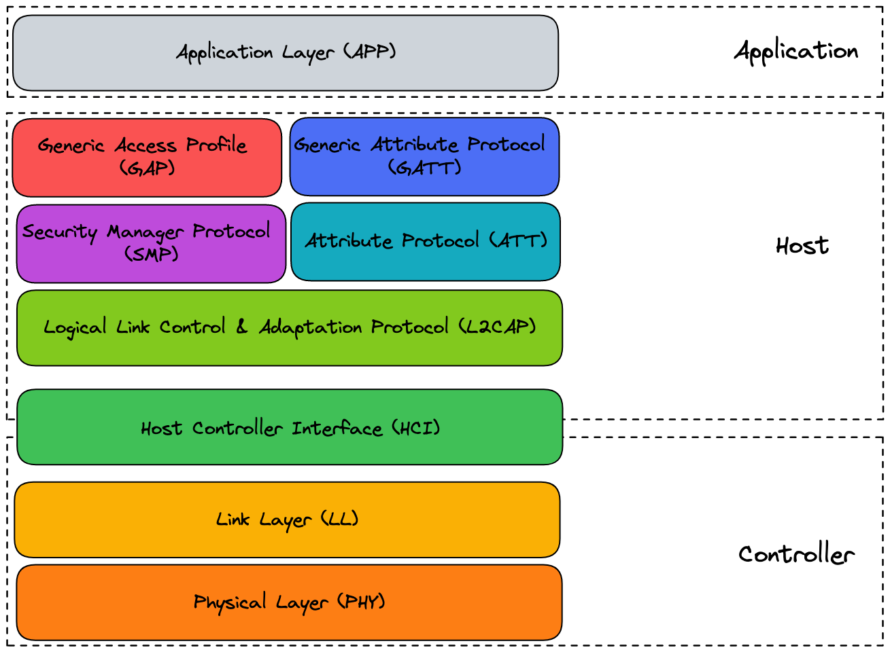
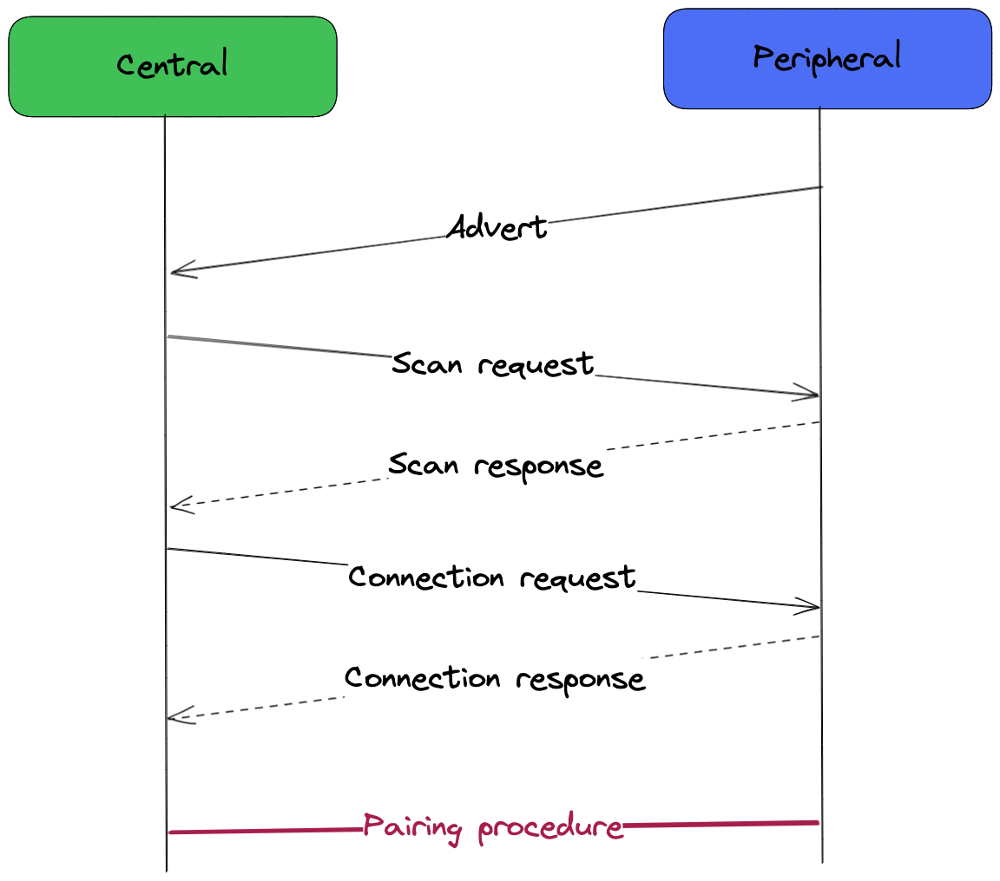
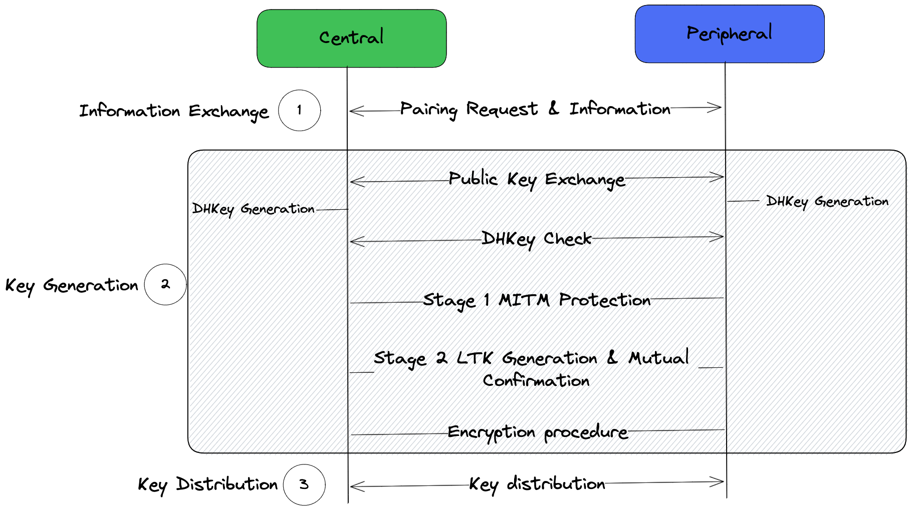
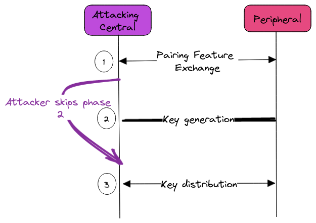

# Writeup CVE-2019-19194

This is a writeup and *theoretical* Proof-of-Concept of CVE-2019-19194.

# Table of Content
- [Summary](#summary)
- [Vulnerable software and version](#vulnerable-software-and-version)
- [Overview](#overview)

   - [Protocol Stack and Architecture](#protocol-stack-and-architecture)
   - [Pairing Procedure](#pairing-procedure)

- [Proof of Concept](#proof-of-concept)
- [References](#references)

## Summary

This report describes how the *Zero LTK Initialisation* vulnerability
([CVE-2019-19194](https://cve.mitre.org/cgi-bin/cvename.cgi?name=CVE-2019-19194)) allows an attacker full communication control over Bluetooth
Low Energy (BLE) application by bypassing the *Secure Connections* pairing procedure.

## Vulnerable software and version

This vulnerability affects products using the Telink SMP implementations that
support the *Secure Connections* pairing procedure.

## Overview

BLE is a low-consumption, short-range
radio communication system. It consists in a set of standardized protocols that
provide remote connectivity and security between two devices.

### Protocol Stack and Architecture

The BLE stack is distributed across two architectural blocks: *Host* and *Controller*. 

The stack distribution allows to implement each block in physically separate components.

A standard logical interface named the *Host Controller Interface* (HCI) allows communication between the two blocks.

On top of the *Host* block sits the BLE application.

#### Physical Layer (PHY)

The physical layer operates in the Industrial, Scientific and Medial (ISM) radio band, across the 2.4GHz spectrum. It uses 40 channels: 3 *advertising* channels and 37 *data* channels.

#### Link Layer (LL)

The link layer (LL) has many responsibilities which will not be described here.
It is governed by a state machine which defines important roles and states:

- An *advertising* device transmits advertisement packets across advertising channels. When advertising, a device informs whether or not it is *connectable*.
- A *scanner* device listens to advertising packets from other devices.
- Once a scanner has received advertising packets from another device, it can initiate a connection procedure if the advertiser is *connectable*.

#### Logical Link Control and Adaptation Protocol (L2CAP)

The logical link control and adaptation protocol acts as a protocol multiplexing layer. It handles *fragmentation* and *recombination* of packets between the layers below and above.

#### Generic Access Profile (GAP)

The Generic Access Profile concerns device *discovery* and *connection*. In other words, GAP defines procedures for the transmission of advertising packets and their reception through scanning. 

#### Generic Attribute Profile (GATT)

Once a connection between two BLE devices has been established, GATT uses a client/server model to exchange data between the two devices. And both client and server use the Attribute Protocole (ATT). 

- Server: the device exposing data accepts commands and emits responses, notifications or indications.
- Client: the device requesting the reading of data sends commands, accepts incoming responses, notifications and indications.

#### Security Manager (SM)

The SM supports security-related procedures such as *pairing*, *bonding* and *key distribution*. Device pairing is considered as the foundation of Bluetooth security: once paired, the two devices can encrypt their communication, authenticate each other, ...

### Pairing procedure 

Among the different protocols involved in BLE communication, the *zero LTK installation* CVE happens during the pairing procedure, in the *Secure Connections* mode.

#### Pairing Modes

- *Legacy* uses a simple process of exchanging secret data to derive a symmetric key with which to encrypt the link during the key distribution phase.
- *Secure Connections* (SC) uses elliptic curve public key cryptography to allow a symmetric key to be derived. That key is used to encrypt the link during the key distribution phase.

The *Secure Connections* pairing mode is the "more secure approach" and was
developed to solve the weaknesses of *Legacy* mode. However, the *zero LTK
installation* CVE found that bad implementations of SC pairing allow to bypass security.

#### Secure Connections pairing process

##### Phase 1 - Information Exchange

The central device sends a pairing request and both devices exchange on their security capabilities and requirements. This phase defines the pairing *mode*.

##### Phase 2 - Key Generation

- Public Key exchange: An exchange of public keys is initiated by the Central device. Both peripheral and central verify that their received key is on the P-256 curve.
- Calculating the *DHKey*: Each device uses its own private key (SK) and the public key of the other device (PK) to calculate their Diffie-Hellman key (DHKey). This way both device posess the same DHKey value.

        Central: DHKey = p256(SKc, PKp)
        Peripheral: DHKey = p256(SKp, PKc)
        
- If MITM protection was requested, an interactive procedure takes place to confirm the authenticity of the pairing devices.
- Calculating the *Long Term Key* (LTK) and mutual confirmation: The devices authenticate each other and calculate a LTK key. A session key is derived from the LTK in order to encrypt the link before Phase 3. 

##### Phase 3 - Key Distribution

Through the encrypted link, the devices can distribute keys.

## Proof-of-Concept

The root cause of *zero LTK installation* is that there is no check of the
state in which the two devices are in the pairing procedure. As such, an
attacking central device can skip the key generation and authentication step. This results in a LTK key set at 0 in the peripheral device, and as such, an easily derivable session key.

>:warning: This is a fully theoretical Proof-of-Concept as I was not able to get a pcap of BLE discovery, advertisement or pairing procedures, nor did I have a BLE device with Telink SMP implementation. 

[Zero LTK installation](./zero-LTK-installation.py) 

## References

- Garbelini, M. E., Wang, C., Chattopadhyay, S., Sun, S., & Kurniawan, E. (2020, July). Sweyntooth: Unleashing mayhem over bluetooth low energy. In Proceedings of the 2020 USENIX Conference on Usenix Annual Technical Conference (pp. 911-925).
- Claverie, T., Docq, N., & Lopes-Esteves, J. Analyse des propriétés de sécurité dans les implémentations du Bluetooth Low Energy.
- [Bluetooth Core Specification 5.0](https://www.bluetooth.com/specifications/specs/core-specification-5-0)
- [Developer Study Guide: Bluetooth Low Energy Security](https://www.bluetooth.com/bluetooth-resources/?types=study-guide)

